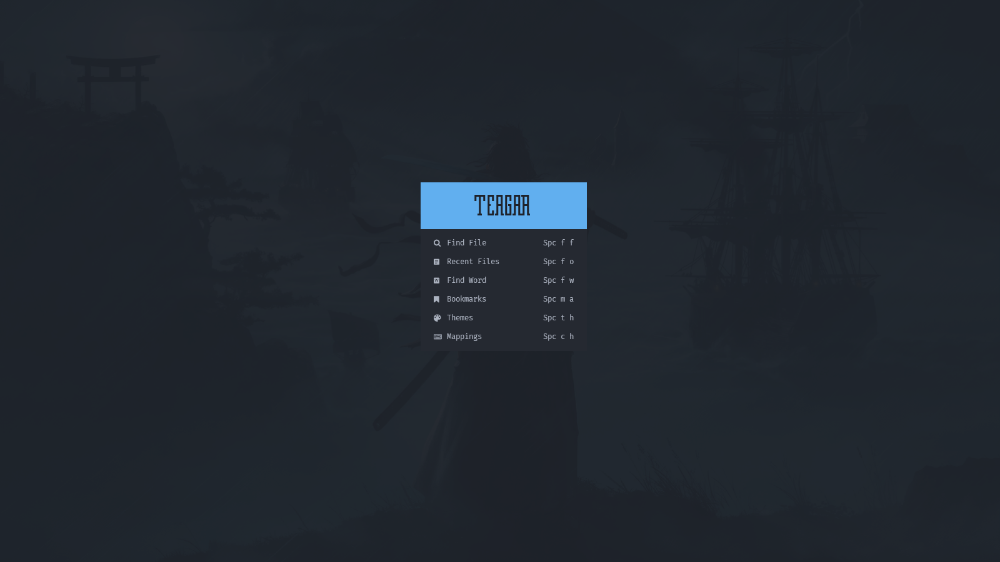

# NvChad-v2-config
## Dashboard


## Install dependencies
1. Install Neovim 9.5+ https://github.com/neovim/neovim/releases/tag/v0.9.5
2. C++ (windows) Compiler https://www.msys2.org/
3. GIT https://git-scm.com/download/win
4. NodeJs https://nodejs.org/en/
5. Ripgrep https://github.com/BurntSushi/ripgrep
6. Lazygit https://github.com/jesseduffield/lazygit
7. Nerd Font https://github.com/ryanoasis/nerd-fonts
8. Windows Terminal (Windows) https://apps.microsoft.com/store/detail/windows-terminal/9N0DX20HK701?hl=en-id&gl=id
9. Powershell (windows) https://apps.microsoft.com/store/detail/powershell/9MZ1SNWT0N5D?hl=en-id&gl=id

# Config Linux (Linux Debian Based)

- Make sure the account is administrator

```
visudo
[nama user] ALL=(ALL:ALL) ALL
[nama user] ALL=(ALL) NOPASSWD:ALL
```

- Install Neovim from link No. 1 above

```
sudo apt-get install wget
mkdir download
cd download
wget https://github.com/neovim/neovim/releases/download/v0.8.1/nvim-linux64.deb
sudo apt-get install ./nvim-linux64.deb
nvim --version
```

- Check GCC availability

```
gcc --version
```

- Install git

```
sudo apt-get install git
git --version
```

- Install NodeJS

```
sudo apt-get install curl
sudo apt install build-essential libssl-dev
curl -o- https://raw.githubusercontent.com/nvm-sh/nvm/v0.35.3/install.sh | bash
source ~/.bashrc
nvm install 18.12.1
node --version
npm --version
```

- Install unzip, ripgrep

```
sudo apt-get install unzip
sudo apt-get install ripgrep
```

- Install Lazygit

```
LAZYGIT_VERSION=$(curl -s "https://api.github.com/repos/jesseduffield/lazygit/releases/latest" | grep '"tag_name":' |  sed -E 's/.*"v*([^"]+)".*/\1/')
curl -Lo lazygit.tar.gz "https://github.com/jesseduffield/lazygit/releases/latest/download/lazygit_${LAZYGIT_VERSION}_Linux_x86_64.tar.gz"
sudo tar xf lazygit.tar.gz -C /usr/local/bin lazygit
lazygit --version
```

## Config Linux / MAC
- Rename Config Original
```
mv ~/.config/nvim/lua/custom/ ~/.config/nvim/lua/custom_backup
```
- New Clone Config
```
git clone https://github.com/Teagar/NvChad_CustomConfigs ~/.config/nvim/lua/custom
```
## Config Windows
- Rename Config Original
```
Rename-Item "$env:LOCALAPPDATA\nvim\lua\custom" "$env:LOCALAPPDATA\nvim\lua\custom_backup"
```
- New Clone Config
```
git clone https://github.com/Teagar/NvChad_CustomConfigs "$env:LOCALAPPDATA\nvim\lua\custom"
```

